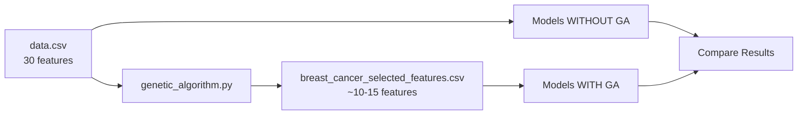

# Breast Cancer Classification with Genetic Algorithm Feature Selection

## 📋 Quick Start

A machine learning project comparing 4 algorithms (ANN, KNN, Naive Bayes, SVM) with and without Genetic Algorithm feature selection for breast cancer classification.

```bash
# Install dependencies
pip install pandas numpy scikit-learn tensorflow

# Run genetic algorithm to select features
python genetic_algorithm.py

# Run any model
python ann_GA.py              # Neural network with GA features
python ann_no_GA.py           # Neural network with all features
```

## 🎯 What This Project Does

1. **Classifies breast cancer** as Benign (B) or Malignant (M) from 30 medical features
2. **Uses Genetic Algorithm** to intelligently select the most important features
3. **Compares 8 models** (4 algorithms × 2 versions) to see if GA improves performance

## 📂 File Structure

| File                                                               | Purpose                                                  |
| ------------------------------------------------------------------ | -------------------------------------------------------- |
| `genetic_algorithm.py`                                             | 🧬 Selects best features using evolutionary optimization |
| `ann_GA.py` / `ann_no_GA.py`                                       | 🧠 Neural Network (with/without GA)                      |
| `knn_GA.py` / `knn_no_GA.py`                                       | 📍 K-Nearest Neighbors (with/without GA)                 |
| `naive_bayes_GA.py` / `naive_bayes_no_GA.py`                       | 📊 Naive Bayes (with/without GA)                         |
| `support_vector_machine_GA.py` / `support_vector_machine_no_GA.py` | ⚡ SVM (with/without GA)                                 |
| `data.csv`                                                         | Original dataset (569 samples, 30 features)              |
| `breast_cancer_selected_features.csv`                              | GA-optimized dataset (fewer features)                    |

## 🔄 Project Workflow



**See [PROJECT_DOCUMENTATION.md](file:///home/girgis/repo/Advanced_AI_Proj/PROJECT_DOCUMENTATION.md) for detailed explanation**

## 🚀 Running Order

1. **First time only**: Run genetic algorithm

   ```bash
   python genetic_algorithm.py  # Creates optimized feature set
   ```

2. **Train models**: Run any of the 8 model files

   ```bash
   python ann_GA.py  # Example: Neural network with GA features
   ```

3. **Compare**: Check which performs better (GA vs no-GA)

## 📊 What Each Model Reports

All models output:

- ✅ **Accuracy**: Overall correctness
- ✅ **Precision**: How many predicted malignant are actually malignant
- ✅ **Recall**: How many actual malignant cases were detected
- ✅ **F1 Score**: Balance of precision and recall
- ✅ **Confusion Matrix**: Detailed breakdown

## 🧬 How Genetic Algorithm Works

Think of it like evolution:

1. **Start**: 20 random feature combinations
2. **Test**: Train KNN on each combination, measure accuracy
3. **Select**: Better combinations survive
4. **Breed**: Mix successful combinations (crossover)
5. **Mutate**: Randomly change some features (exploration)
6. **Repeat**: 30 generations
7. **Result**: Best feature subset saved

## 🎓 For New Developers

### Understanding the Comparison

| Aspect           | WITHOUT GA | WITH GA           |
| ---------------- | ---------- | ----------------- |
| Features used    | All 30     | ~10-15 (selected) |
| Training speed   | Slower     | Faster            |
| Overfitting risk | Higher     | Lower             |

### Making Changes

**Change GA settings** in `genetic_algorithm.py`:

```python
population_size = 20      # Try: 30, 50
num_generations = 30      # Try: 50, 100
```

**Change KNN neighbors** in KNN files:

```python
model = KNeighborsClassifier(n_neighbors=5)  # Try: 3, 7
```

**Change neural network size** in ANN files:

```python
model.add(Dense(16, activation='relu'))  # Try: 32, 64
```

## 📈 Next Steps

1. **Run all 8 models** and create comparison table
2. **Analyze**: Did GA improve accuracy? Which algorithm is best?
3. **Enhance**:
   - Add cross-validation
   - Try different GA fitness functions
   - Visualize feature importance
   - Implement ensemble methods

## 🔬 Technical Details

- **Dataset**: Wisconsin Breast Cancer (569 samples)
- **Train/Test Split**: 80% / 20%
- **Scaling**: StandardScaler (except Naive Bayes)
- **Encoding**: M→1, B→0
- **Reproducibility**: All use `random_state=42`

## ⚠️ Important Notes

- This is for **research/education only** - NOT for actual medical diagnosis
- Always run `genetic_algorithm.py` before running `*_GA.py` files
- All models use same train-test split for fair comparison

---

**For complete details**: See [PROJECT_DOCUMENTATION.md](file:///home/girgis/repo/Advanced_AI_Proj/PROJECT_DOCUMENTATION.md)
